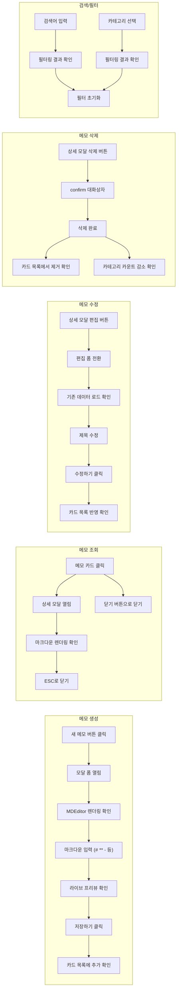
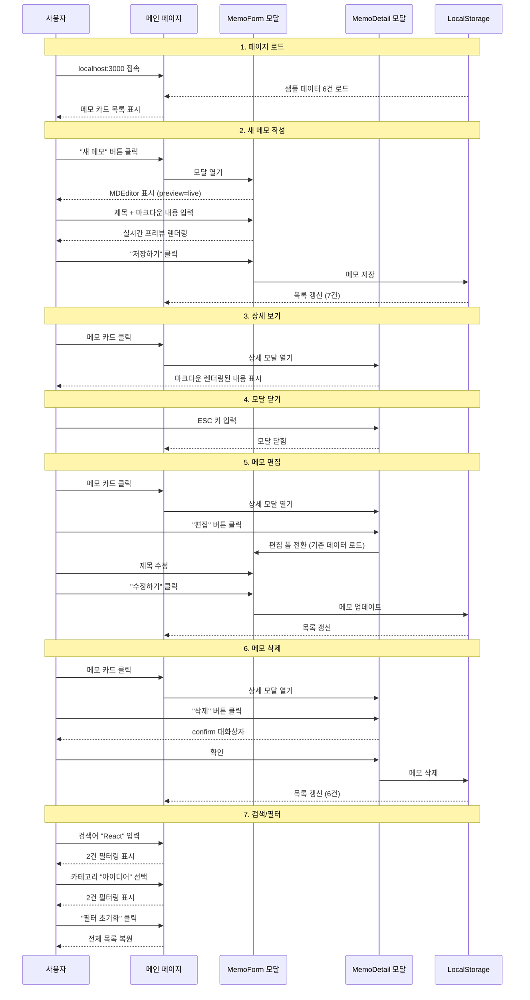

# 메모 앱 브라우저 자동화 테스트 리포트

## 개요

메모 앱의 주요 기능에 대해 브라우저 자동화(Cursor IDE Browser MCP)를 활용하여 수행한 기능 테스트 결과 리포트입니다. 메모 CRUD, 마크다운 에디터/뷰어, 상세 보기 모달, 검색/필터 등 전체 사용자 흐름을 검증하였습니다.

- **테스트 일시**: 2026년 2월 24일
- **테스트 환경**: Next.js 15.4.4 개발 서버 (`localhost:3000`)
- **테스트 도구**: Cursor IDE Browser Automation (MCP)
- **테스트 대상 브랜치**: `base`

## 테스트 결과 요약

| # | 테스트 항목 | 결과 |
|---|---|---|
| 1 | 페이지 로드 및 초기 상태 확인 | PASS |
| 2 | 새 메모 작성 (마크다운 에디터 + 라이브 프리뷰) | PASS |
| 3 | 메모 카드 클릭 → 상세 보기 모달 (마크다운 렌더링) | PASS |
| 4 | 모달 닫기 (ESC / 닫기 버튼) | PASS |
| 5 | 메모 편집 기능 | PASS |
| 6 | 메모 삭제 기능 | PASS |
| 7 | 검색 및 카테고리 필터 기능 | PASS |

**전체: 7/7 PASS (통과율 100%)**

## 다이어그램

### 테스트 커버리지

### 사용자 흐름 시퀀스

## 상세 테스트 결과

### 1. 페이지 로드 및 초기 상태 확인

| 항목 | 기대 결과 | 실제 결과 | 판정 |
|---|---|---|---|
| 페이지 접근 | `localhost:3000` 정상 로드 | 200 응답, 페이지 렌더링 완료 | PASS |
| 헤더 표시 | "메모 앱" 제목 + "새 메모" 버튼 | 정상 표시 | PASS |
| 샘플 데이터 | 6개 샘플 메모 카드 표시 | 6개 카드 확인 (프로젝트 회의 준비, React 18, 습관 트래커, 주말 여행, 독서 목록, 성능 최적화) | PASS |
| 검색/필터 UI | 검색 입력, 카테고리 드롭다운 표시 | 정상 표시, 카테고리별 카운트 정확 | PASS |

### 2. 새 메모 작성 (마크다운 에디터 + 라이브 프리뷰)

| 항목 | 기대 결과 | 실제 결과 | 판정 |
|---|---|---|---|
| 모달 폼 열기 | "새 메모" 클릭 시 모달 표시 | "새 메모 작성" 모달 정상 열림 | PASS |
| MDEditor 렌더링 | 마크다운 에디터 툴바 표시 | Bold, Italic, Strikethrough, HR, Title, Link, Quote, Code, Code Block, Image, Table, List 등 전체 툴바 표시 | PASS |
| 모드 전환 버튼 | Edit/Live/Preview 버튼 표시 | Edit(Ctrl+7), Live(Ctrl+8), Preview(Ctrl+9) 버튼 정상 표시 | PASS |
| 마크다운 입력 | 마크다운 문법 입력 가능 | `# Hello Markdown`, `**Bold**`, `*italic*`, `- list`, `` `code` `` 입력 완료 | PASS |
| 라이브 프리뷰 | 입력과 동시에 렌더링 | h1 헤딩, bold/italic 텍스트, 리스트 아이템, 인라인 코드 실시간 렌더링 확인 | PASS |
| 저장 | 저장 후 카드 목록에 추가 | "마크다운 테스트 메모" 카드가 목록 최상단에 추가됨, 개인 카테고리 카운트 2→3 | PASS |
| 카드 미리보기 strip | 카드에서 마크다운 기호 제거 | "Hello Markdown Bold text and italic text item 1 item 2 inline code" (기호 없이 표시) | PASS |

### 3. 메모 카드 클릭 → 상세 보기 모달

| 항목 | 기대 결과 | 실제 결과 | 판정 |
|---|---|---|---|
| 카드 클릭 | 상세 보기 모달 열림 | "마크다운 테스트 메모" 클릭 시 모달 정상 열림 | PASS |
| 마크다운 렌더링 | 내용이 마크다운으로 렌더링 | h1("Hello Markdown"), bold/italic 텍스트, 리스트(item1, item2), 인라인 코드 정상 렌더링 | PASS |
| 모달 버튼 | 편집/삭제/닫기 버튼 표시 | 편집, 삭제, 닫기(ESC) 버튼 모두 표시 | PASS |

### 4. 모달 닫기

| 항목 | 기대 결과 | 실제 결과 | 판정 |
|---|---|---|---|
| ESC 키 닫기 | ESC 입력 시 모달 닫힘 | 모달 정상 닫힘, 메인 목록 복원 | PASS |
| 닫기 버튼 | 닫기 버튼 클릭 시 모달 닫힘 | 모달 정상 닫힘, 메인 목록 복원 | PASS |

### 5. 메모 편집

| 항목 | 기대 결과 | 실제 결과 | 판정 |
|---|---|---|---|
| 편집 전환 | 상세 모달 → 편집 폼으로 전환 | "메모 편집" 폼 정상 열림, "수정하기" 버튼 표시 | PASS |
| 기존 데이터 로드 | 제목, 카테고리, 내용 사전 로드 | 제목("마크다운 테스트 메모"), 마크다운 내용 모두 정상 로드 | PASS |
| MDEditor 편집 | 기존 마크다운 내용을 에디터에서 편집 가능 | 마크다운 원문이 에디터에 표시, 프리뷰 동시 동작 | PASS |
| 수정 저장 | "수정하기" 클릭 후 카드에 반영 | 제목이 "마크다운 테스트 메모 (수정됨)"으로 변경, 카드 목록 정상 반영 | PASS |

### 6. 메모 삭제

| 항목 | 기대 결과 | 실제 결과 | 판정 |
|---|---|---|---|
| 삭제 확인 | confirm 대화상자 표시 | 삭제 확인 대화상자 표시 (자동 수락) | PASS |
| 카드 제거 | 목록에서 해당 카드 삭제 | "마크다운 테스트 메모 (수정됨)" 카드 제거됨 | PASS |
| 카운트 갱신 | 카테고리 카운트 감소 | 개인 카테고리 3→2로 감소 | PASS |
| 모달 닫힘 | 삭제 후 모달 자동 닫힘 | 정상 닫힘, 메인 목록으로 복원 | PASS |

### 7. 검색 및 카테고리 필터

| 항목 | 기대 결과 | 실제 결과 | 판정 |
|---|---|---|---|
| 키워드 검색 | "React" 검색 시 관련 메모만 표시 | 2개 메모 표시: "React 18 새로운 기능 학습", "새로운 앱 아이디어: 습관 트래커" (내용에 React Native 포함) | PASS |
| 카테고리 필터 | "아이디어" 선택 시 해당 카테고리만 표시 | 2개 메모 표시: "습관 트래커", "성능 최적화 아이디어" | PASS |
| 필터 초기화 | "필터 초기화" 클릭 시 전체 복원 | 전체 6개 메모 복원, 검색어 및 카테고리 초기화 | PASS |

## 발견된 이슈

테스트 중 기능적 결함은 발견되지 않았습니다.

## 참고사항

- 스크린샷 캡처 시 타임아웃이 발생하여 시각적 증거는 포함되지 않았으나, 접근성 트리(Accessibility Snapshot) 기반으로 모든 요소 렌더링 및 상호작용을 검증하였습니다.
- 모든 테스트는 개발 서버 환경(`npm run dev`)에서 수행되었습니다.
- LocalStorage 기반 데이터 영속화는 브라우저 세션 내에서 정상 동작을 확인하였습니다.
